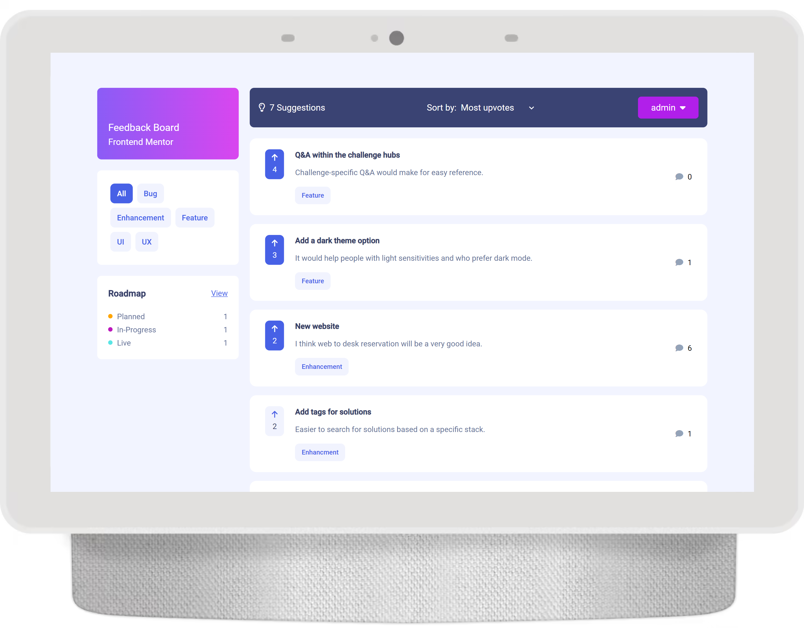
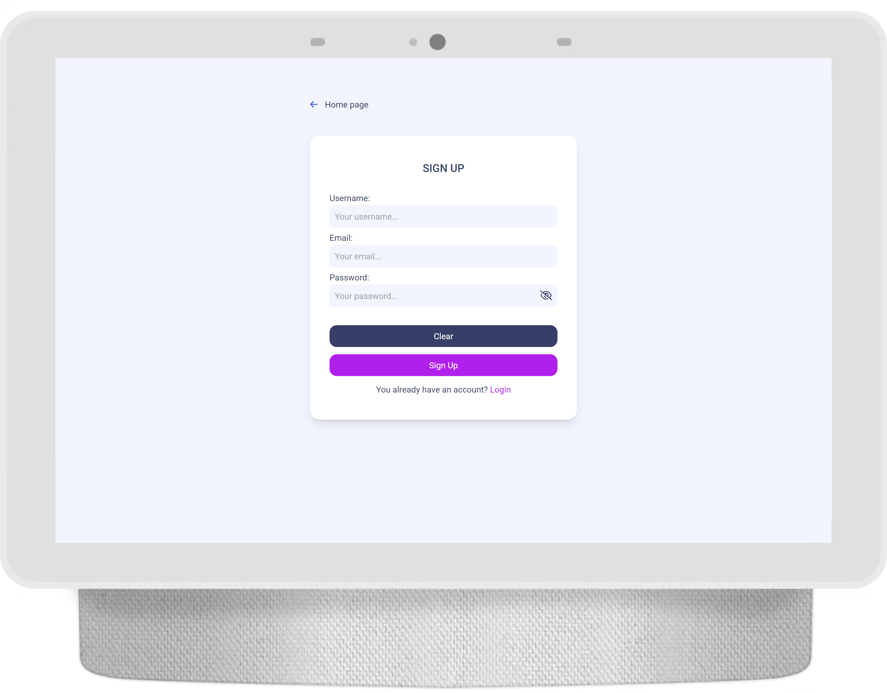

# Product-Feedback-App

### Description:
Product-feedback-app is a full stack application which is similiar to the some kind of blog. Users can create account, add/edit/delete their feedbacks, comments other people ideas or upvote them. Moreover you can filter feedbacks by category or sort them by upvotes and comments, so you can easily see who had the best idea. This app has also admin panel on wich moderators & admins can ban users. Admins can also change roles to eventually add new moderator or remove it from someone.

Design and logic of this app was inspired by [Frontend Mentor challenge](https://www.frontendmentor.io/challenges/product-feedback-app-wbvUYqjR6) but I added a lot of own features. Some asspects can be different because my goal wasn't to built it in the same style but generally design is very simliar.

### Used technologies: ⚙️
- Angular v15 (with RxJs library to state management)
- Express.js
- Node.js
- MongoDB
- Tailwind CSS

### Features: ⭐
#### For all web users:
- registration/logging in
- filtering by categories
- sorting by (least, most) comments and upvotes
- responsive design
#### For authorized users:
- adding & editing & deleting feedbacks
- moving feedbacks to appropriate sections
- adding comments to other people feedbacks
#### For moderators & admin:
- admin panel
- ban user accoucnts (both)
- change users roles (only admin)

### How to run the project?
Backend needs private variables such as password to database. For obvious reason I didn't put it on github, so at this moment you can clone repo, install required packages and see only a small part of this application. Probably is some solution to solve this problem but actually I don't have any idea how to deal with it.
Neverthless if you really want to see this project you can write to me and maybe I would give you this secret data :). 

### Screenshots: 📓
Screenshots of mobile view you can check [here](https://github.com/LKochan123/Product-Feedback-App/tree/main/Product-Feedback-App/src/assets/app-screenshots). 
Below you can see only PC view. 

Home page:

Add feedback:

Edit/delete feedback:

Feedback roadmap:

Feedback information & comments:

Modeartor & admin panel to ban users:

Admin panel to change user roles:

Signup form:

